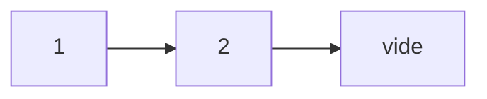
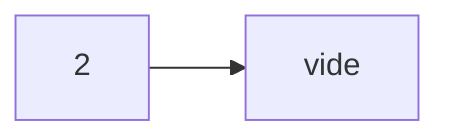
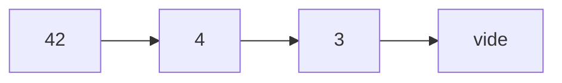
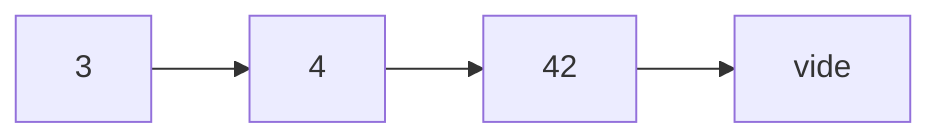
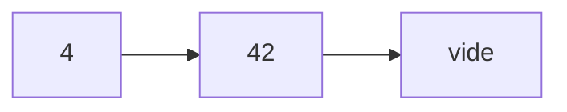

# LIFPF TP4: Structures et fonctions génériques et mutuellement récursives

Lancez régulièrement tous vos tests via `ocaml tp4.ml` depuis le bash ou via `#use "tp4.ml";;` depuis l'interpréteur intéractif.

## 0. Retour sur le TP3

Si ce n'est pas fait, **terminer** le [TP3](tp3.md) jusqu'à la section 3.2.2 inclue.

## 1. Arbres n-aires

Un arbre n-aire est un arbre dans lequel chaque noeud peut avoir un _nombre quelconque de fils_.
Dans le cadre de cet exercice, on va considérer des arbres dont les données sont stockées **uniquement** dans les feuilles.

Une forêt est une liste d'arbres.
Un noeud contiendra donc simplement une forêt.

### 1.1. Type arbre n-aire

> Définir un type `'a arbre_n` pour représenter les arbres n-aires contenant des éléments de type `'a`. Un arbre est soit _une feuille contenant un élément_, soit un _noeud contenant une forêt_.
>
> Définir quelques arbres pour pouvoir tester.
>
> Donner deux exemples d'arbres ne contenant **aucun** éléments.
>
> Quel est le type inféré par OCaml pour ces arbres ? Pourquoi ?

### 1.2. Hauteur d'un arbre

On souhaite maintenant pouvoir calculer la hauteur d'un arbre.
Comme un arbre peut contenir une forêt, il faut deux fonctions mutuellement récursives: une fonction qui donne la hauteur d'un arbre et une autre qui donne la hauteur maximale des arbres dans une forêt.

> Coder `hauteur_arbre` et `hauteur_foret`, deux fonctions mutuellement récursives qui calculent respectivement la hauteur d'un arbre et la hauteur maximale des arbres d'une forêt. Tester avec `assert`.

### 1.3. Éléments d'un arbre

On souhaite maintenant pouvoir construire la liste des éléments d'un arbre.
Comme un arbre peut contenir une forêt, il faut **deux fonctions mutuellement récursives** :

- une fonction qui donne les éléments _d'un arbre_;
- une autre qui donne les éléments _d'une forêt_.

Par ailleurs on veut éviter de faire des concaténations qui vont s'avérer coûteuses, on va donc écrire ces fonctions en **s'appuyant sur un accumulateur**.
Les fonctions vont ainsi ajouter les éléments de l'arbre/de la forêt à l'accumulateur.

> Coder deux fonctions mutuellement récursives `list_of_arbre_aux` et `list_of_foret` qui vont prendre un arbre / une forêt en argument, ainsi qu'une liste d'éléments `acc` qui vont ajouter en tête de `acc` les éléments de l'arbre / de la forêt. Vous pouvez aussi commencer par écrire une version **sans** accumulateur et la modifier ensuite.
>
> Tester avec `assert`.
>
> Placer la définition des deux fonctions à l'intérieur d'une fonction `list_of_arbre` (via un `let ... in ...`). Le code de `list_of_arbre` fera ensuite simplement appel à `list_of_arbre_aux` avec un accumulateur initial vide.
>
> Modifier les tests précédents pour tester `list_of_arbre` et pas `list_of_arbre_aux` (qui est maintenant masquée).

### 1.4. Minimum d'un arbre

On veut maintenant extraire _l'élément minimal d'un arbre_.
Attention, si l'arbre est vide, le minimal n'est **pas** défini, le résultat sera donc un `'a option`.
Il faudra prendre en compte cette spécificité lors du traitement des appels récursifs, typiquement en faisant un pattern matching sur le résultat de l'appel récursif.

Remarque : la fonction `min` est prédéfinie en OCaml. Son type est `'a -> 'a -> 'a`. On l'utilisera pour obtenir le minimum de deux éléments de l'arbre.
On évitera cependant de l'utiliser directement avec des `option` car elle ne donnera pas le résultat voulu. Par exemple, `min None (Some 3)` vaut `None`.

> Définir deux fonctions mutuellement récursives `minimum` et `minimum_foret` qui donne le minimum d'un arbre / d'une forêt. Tester avec `assert`.

### 1.5. Reduce

On peut remarquer que dans le code de `minimum` et `minimum_foret`, la fonction `min` est utilisée pour combiner deux résultats.
On pourrait donc généraliser ce code pour qu'il fonctionne avec **n'importe quelle fonction de combinaison des résultats**.
La fonction généralisée est souvent appelée `reduce`.

On veut donc coder les fonctions `reduce` et `reduce_foret` qui généralisent `minimum`. Elles prendront un argument supplémentaire `f` qui est la fonction de combinaison des résultats. Dans le code de ces fonctions, `f` sera utilisée à la place de `min`. Si l'arbre / la forêt contient des éléments de type `'a`, alors le type de `f` sera `'a -> 'a -> 'a`.

> Coder `reduce` et `reduce_foret`. Tester en reprenant les cas de test utilisés pour `minimum`, en utilisant `min` comme valeur pour `f`.

Si ce n'est pas déjà fait, définir quelques exemples arbres dont le contenu sera de type `int`.

> Tester `reduce` et `reduce_foret` avec un fonction qui fait l'addition (en `int`) de ses deux arguments, ou le produit des éléments, le maximum etc.

**Remarque** : le type de l'addition est `int -> int -> int`. Cela fonctionne car le type de `reduce` est `('a -> 'a -> 'a) -> 'a arbre_n -> 'a option`, donc `reduce` a aussi le type `(int -> int -> int) -> int arbre_n -> int option`.

## 2. FIFOs basées sur des listes

On souhaite implémenter une structure de file (en anglais **FIFO**: _First In First Out_).
Dans ce type de structure, on veut pouvoir ajouter et retirer des éléments de manière à ce que les éléments soient retirés _dans l'ordre où ils ont été ajoutés_.

Une implémentation naïve de FIFO basée sur une liste pose des problèmes de performance :

- soit on ajoute les nouveau éléments _en tête de liste_, mais il faut alors les retirer en fin de liste ce qui force à récrire toute la liste à chaque supression;
- soit in ajoute _en fin de liste_, mais ici c'est le coût à l'insertion qui est prohibitif puisqu'on reconstruit la liste au moment de l'ajout.

Une autre technique consiste à utiliser **deux** listes.
La première (à gauche) est destinée à recevoir les nouveau éléments, alors que la seconde à droite sera utilisée pour stocker les éléments à retirer :

- dans la liste de gauche, les éléments sont stockés dans l'ordre **inverse** de leur insertion : le dernier élément inséré est en tête de liste.
- dans la liste de droite, les éléments sont stocké dans l'ordre où ils doivent être récupérés, c'est à dire **le plus ancien en tête de liste**.

Reste à transférer des éléments entre la liste de gauche et celle de droite.
C'est là que cette technique trouve son efficacité : on transfère de la gauche à la droite lorsque l'on essaie de retirer un élément de la liste de droite alors qu'elle est vide.

On profite de ce transfert pour renverser l'ordre des éléments (comme dans `renverse_ajoute` du TP2).
Chaque élément est donc placé exactement _une fois dans chacune des listes_.
Donc remplir et vider la file s'effectue donc avec un nombre d'opérations linéaire dans le nombre d'éléments ajoutés et retirés, contrairement aux versions naïves pour lesquelles le nombre d'opérations est quadratique.

### 2.1. Exemple

###### 1. On suppose qu'on a la situation de départ suivante :

Gauche

Droite

###### 2. On retire le premier élément (1) :

Gauche

Droite

###### 3. On ajoute un élément (42) :

Gauche

Droite

###### 4. On retire le premier élément (2) :

Gauche

Droite

###### 5. On retire le premier élément (3) :

On effectue d'abord le transfert des éléments de gauche à droite, puis on retire l'élément comme avant

**Transfert :**

Gauche

Droite

**Retirer 3 :**

Gauche

Droite

### 2.2 Type FIFO et ajout d'éléments

> Définir un type `'a fifo` avec un seul constructeur contenant deux listes dont les éléments sont de type `'a`. Définir quelques exemples d'éléments de ce type.

> Définir une fonction `push_fifo` qui prend en argument un élément `e` et une fifo `f` et renvoie la fifo contenant les éléments de `f` puis `e` en insérant `e` en tête de la liste de gauche. Tester avec `assert` et les fifos exemples créées précédement.

> Définir une fonction `push_list_fifo` qui prend une liste d'éléments `l` et une fifo `f` et renvoie la fifo contenant tous les éléments de `f` suivis de tous les éléments de `l` insérés dans l'ordre de `l` (i.e. l'élément en tête de `l` avant les autres). Tester avec `assert` et les fifos exemples créées précédement.

### 2.3 Récupération des éléments et transfert

On va tout d'abord coder la fonction `transfert_fifo` qui déplace les éléments de la liste de gauche dans celle de droite en inversant leur ordre. On pourra s'inspirer de `renverse_ajoute` du TP2 pour cette fonction.

> Coder la fonction `transfert_fifo` et la tester avec `assert` et les fifos exemples créées précédement.

On peut maintenant coder la fonction `pop_fifo` qui va récupérer un élément dans la fifo.

Dans cette fonction, on distinguera le cas d'une fifo avec au moins un élément à droite de celle avec la liste droite vide. Dans le deuxième cas, on utilisera `transfert_fifo` pour basculer les éléments de gauche à droite avant de prendre la tête de liste à droite.

Le résultat de `pop_fifo` sera une paire contenant d'une part la fifo sans l'élément retiré et d'autre part l'élément retiré. Comme une fifo peut être vide, il n'y a pas forcément d'élément à retirer. La valeur de ce dernier sera donc une option, et considérera par convention que retirer un élément d'une fifo vide produit une fifo vide (et `None` pour la valeur de l'élément retiré). Le type de `pop_fifo` sera donc `'a fifo -> ('a fifo * 'a option)`.

> Coder la fonction `pop_fifo` et la tester avec `assert` et les fifos exemples créées précédement.

> Coder la fonction `pop_all_fifo` qui prend une fifo `f` et renvoie la liste contenant tous les éléments dans l'ordre de `f`, c'est à dire qu'on veut le premier élément retiré de `f` en tête de la liste résultat. Tester avec `assert` et les fifos exemples créées précédement.
