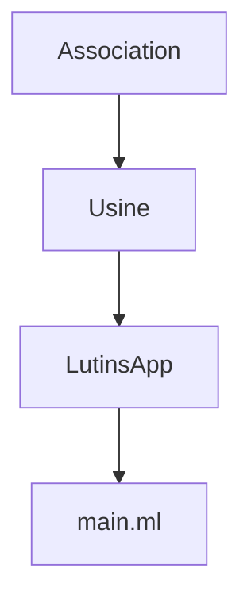

# TP5: Parcours génériques de structure et projets dune

## 1. Arbre n-aires: recodage

Dans cet exercice, on reprend les fonctionnalités développées dans la section 1. du [TP4](tp4.md), mais en les recodant avec les fonctions déjà fournies avec OCaml.

Remarque: en OCaml on peut écrire `fun x y -> ...` à la place de `fun x -> fun y -> ...`.

### 1.1. Recodage de quelques fonctions de base avec la bibliothèque standard OCaml

> Reprendre le type `'a arbre_n` du TP4, section 1.1

On pourra reprendre les tests écrits lors du TP4.

> Recoder la fonction `hauteur_arbre` sans utiliser `hauteur_foret`, mais en appelant directement `List.map` et `List.fold_left` pour extraire les hauteurs des arbres fils et trouver la hauteur maximale parmi celles-ci.

> Recoder `list_of_arbre_aux` en utilisant `List.fold_right` pour remplacer les appels à `list_of_foret`.
> Encapsuler `list_of_arbre_aux` avec un `let ... in ...` dans la définition de `list_of_arbre`.
> On écrira le `let` avant de prendre l'argument de `list_of_arbre`.

### 1.2 Gestion d'option, fold et minimum

Pour gérer proprement le calcul du minimum, on va s'équiper d'un décorateur `lift_option_2` ayant le comportement suivant. Soit `f: 'a -> 'a -> 'a`. On suppose que `g = lift_option_2 f`. Alors `g` aura le type `'a option -> 'a -> 'a option`. Si le premier argument de `g` est `None`, alors `g` renvoie `Some x` si `x` est son second argument. Sinon `g` renvoie `Some (f y x)` où `y` est la valeur contenue dans son premier argument et `x` est son second argument.

> Définir `lift_option_2` en commençant par préciser son type. Tester avec `assert` en passant la fonction `min` à `lift_option_2`.

On veut à présent définir `fold_left_arbre` qui aggrège une valeur via un accumulateur à la manière de `List.fold_left`, mais en parcourant un arbre et pas une liste.

> Définir le type, puis coder `fold_left_arbre`. On pourra utiliser intelligement `List.fold_left` pour gérer le cas des `Noeud`.
> Tester en calculant la somme des éléments d'arbres bien choisis.

On peut remarquer que `reduce` du TP4 ressemble énormément à `fold_left_arbre`: les deux vont parcourir les éléments de l'arbre les combinant via un accumulateur. Elles diffèrent cependant sur les points suivants:

- `reduce` prend en argument une fonction de type `'a -> 'a -> 'a` alors que `fold_left_arbre` prend une fonction un peu plus générique de type `'b -> 'a -> 'b`.
- `reduce` renvoie forcément une `option` alors que `fold_left_arbre` renvoie uniquement une option si `'b` est lui-même une `option`.

> En utilisant intelligement `fold_left_arbre`, recoder `reduce`.

> Recoder `list_of_arbre` en utilisant `fold_left_arbre`.

## 2. Application et compilation séparée

On souhaite implémenter une application de gestion de la fabrication des jouets de Noël par les lutins du Père-Noël.
Bien que l'application soit modeste on souhaite pouvoir la faire grossir selon les besoins.
On va donc dès le départ la diviser en différents modules, le code de l'application contenant simplement des appels aux bonnes fonctions des autres modules.

Les différentes parties de l'application intiale sont les suivantes:

- Un module `Association` de gestion des associations clé-valeur basé sur des arbres binaires de recherche. On veut pouvoir, à terme (mais pas dans ce TP), remplacer les usages de ce module par un module de la bibliothèque standard OCaml.
- Un module `Usine` contenant les types liés au métier de l'application: lutins, jouets, etc. Ce module contiendra également les différentes fonctions utilisées pour gérer l'usine.
- Un module `LutinsApp` qui va contenir le code de gestion des arguments en ligne de commande

On peut résumé les dépendances simples des modules de cette application via le diagramme suivant (la flèche signifie "est utilisé par"):



### 2.1. Mise en place d'un projet `dune`

**Remarque:** Si vous utilisez votre propre machine, il faut installer `opam` et `dune`. Voir la [documentation opam](https://opam.ocaml.org/doc/Install.html) et la [documentation dune](https://dune.build/install). Cette installation est déjà faite pour les machines des salles TP, mais il faut bien avoir effectué la configuration de votre compte ([cf doc](../CONFIGURATION.md)).

**Attention:** un problème se pose avec l'utilisation sur les machines TP. Les commandes `dune` se bloquent. Il faut impérativement travailler dans un répertoire propre à la machine, par exemple `/tmp/p1234567` où `p1234567` est votre login étudiant. Il vous faudra versionner votre projet dune sur https://forge.univ-lyon1.fr, ou à défaut vous envoyer le .zip du projet. Attention à exclure les répertoires `_build`.

> Créer une nouveau projet dune intitulé `lutins` via la commande suivante:
>
> ```
> dune init project lutins
> ```

La commande va créer un répertoire `lutins`. Ce répertoire contiendra un ou plusieurs sous-répertoires nommés `_build` qui vont contenir les défférents fichiers générés par les outils de compilation OCaml.

> Lister les fichiers et les répertoires générés par la commande `dune init`.

> Lancer la commande `dune exec lutins` depuis le répertoire du projet. Dans quel fichier se trouve le code exécuté ?

> Ajouter le code suivant dans le fichier `test/lutins.ml`:
>
> ```ocaml
> assert (2=1)
> ```
>
> puis lancer la commande `dune test`.
> Constater l'erreur, puis supprimer cette ligne de test.

Pour finir créer à la racine du projet un fichier `.ocamlformat` avec le contenu suivant:

```
profile = default
margin = 70
```

Si vous avez installé `ocamlformat` (via `opam` sur votre machine, il sera préinstallé en salle TP), cela permettra de reformatter le code (c-à-d. réarranger la présentation).

### 2.2. Premier module

Créer deux fichiers dans le répertoire `lib`. Le premier, nommé `usine.ml` contiendra le code du module `Usine`. Le second, `usine.mli` contiendra les déclarations de type et de fonction pour les modules et les fichiers qui utiliseront `Usine`.

> Dans le fichier `usine.ml`, définir un type somme `jour` pour représenter les jours de la semaine (un jour par constructeur).
> Définir également une fonction `string_of_jour` permettant d'obtenir la `string` représentant le jour passé en argument.

Le fichier `usine.ml` va ainsi contenir l'**implémentation** du module `Usine`.

On veut maintenant indiquer que ces deux déclarations sont disponibles aux autres modules. Pour cela ajouter le code suivant à l'autre fichier, c'est-à-dire `usine.mli`:

```ocaml
(**
Les jours de la semaine.
*)
type jour = Lundi | Mardi

(**
Donne une représentation sous forme de string d'un jour.
*)
val string_of_jour: jour -> string
```

Noter le commentaire de documentation, qui devient plus important ici car le code n'est pas accessible en dehors du module `Usine`.

`usine.mli` contient l'**interface** du module `Usine`.

### 2.3. Utilisation du module `Usine`

On souhaite maintenant utiliser ce module. Pour cela on va d'abord vérifier que la ligne suivante se trouve dans le fichier `bin/dune` (on l'ajoutera si elle est manquante):

```
 (libraries lutins)
```

le contenu du fichier doit ressembler à ce qui suit:

```
(executable
 (public_name lutins)
 (name main)
 (libraries lutins))
```

Le module `Usine` est maintenant disponible, pour utiliser ses types et ses fonctions depuis `main.ml`, il faudra les précéder de `Lutins.Usine`, par exemple pour utiliser le constructeur `Lundi`, on écrira `Lutins.Usine.Lundi`.

> Modifier le code de `main.ml` afin afficher en plus `Nous sommes ` suivi d'un jour de la semaine traduit en string via un appel à `string_of_jour`.

> Vérifier le bon fonctionnement du programme en lançant `dune exec lutins`. Dune va recompiler le programme et la bibliothèque (c'est-à-dire le code dans `lib` avant de lancer l'exécution du code).

On peut constater que l'usage de `Lutins.Usine` va vite devenir lourd.
Pour éviter ce problème, on peut utiliser la directive `open Lutins.Usine;;` en début de fichier. Le compilateur va ensuite directement chercher dans le module `Lutins.Usine` les définitions de `jour` et `string_of_jour` sans que l'on ait besoin de les précéder de `Lutins.Usine.`.

Enfin on veut pouvoir utiliser le système de test de dune avec le nouveau module `Lutins.Usine`. Pour cela, il suffit d'ajouter dans le fichier `test/dune` une déclaration `libraries` similaire à ce qui est fait dans `bin/dune`:

```
(test
 (name lutins)
 (libraries lutins))
```

Ensuite on peut utiliser, et donc tester, les types et les fonctions déclarées dans `usine.mli` comme cela a été fait dans le `main.ml`.

**Remarque:** Il se peut l'extension OCaml Platform de VSCode ait parfois du mal à se mettre à jour avec les nouvelles définitions. Si cela compile correctement avec `dune`, mais que VSCode indique des erreurs, c'est `dune` qui a raison.

> Ajouter des `assert` pour tester `string_of_jour`. Lancer `dune test` pour vérifier que tous vos tests passent correctement.

### 2.4. Masquer des définitions

On veut maintenant définir au sein de l'usine de fabrication de jouets une notion de _configuration_ de la journée. La configuration d'une journée permet de connaître deux choses: pour chaque lutin, le jouet qu'il va fabriquer et pour chaque lutin et chaque jouet la quantité qu'il peut fabriquer. Les jouets et les lutins étant représentés par des chaînes de caractères, il se peut qu'un lutin ou un jouet passé en argument n'existe pas. On utilise donc une `option` pour gérer cette situation.

On va maintenant créer dans le module `Usine` un type `configuration` qui sera simplement une paire de fonctions. La première aura le type `string -> string option`, la seconde aura le type `string -> string -> int option`.

Définir ce type dans `usine.ml`:

```ocaml
type configuration = (string -> string option) * (string -> string -> int option);;
```

Dans `usine.mli` on va en revanche, on va masquer les détails de la définition et juste conserver le nom du type:

```ocaml
type configuration;;
```

Tel quel, on ne peut pas manipuler les valeurs de ce type à l'extérieur du module `Usine`. On va donc lui ajouter des fonctions pour créer des configurations et en extraire les différentes parties.

Ajouter les fonctions suivantes, en les déclarant dans l'interface du module `Usine`

- `mk_configuration: (string -> string option) -> (string -> string -> int option) -> configuration` cette fonction va fabriquer une paire avec ses deux arguments.
- `get_jouet: configuration -> (string -> string option)` cette fonction va extraire le premier élément de la paire
- `get_nb_jouets: configuration -> (string -> string -> int option)` cette fonction va extraire le deuxième élément de la paire

Tester ces fonctions dans `test/lutins.ml` avec une fonction qui renvoie toujours "toupie" pour le choix du jouet et toujours `42` pour le nombre de jouets.

### 2.5. Codage de l'application de gestion des jouets - début

On dispose à présent des éléments de langage pour pouvoir coder le début de l'application de gestion de l'usine de jouets.

Ajouter au module `Usine` une fonction `jour_of_string` qui prend une `string` et renvoie une option de `jour` avec `Some` du bon jour si la chaîne représente bien un jour et `None` sinon.

Créer un module `Association` contenant le code pour gérer des associations clé-valeur. Il contiendra:

- un type générique `('a,'b) assoc_t` dont l'implémentation est cachée;
- une fonction `put: 'a -> 'b -> ('a, 'b) assoc_t -> ('a, 'b) assoc_t` qui associe une clé (de type `'a`) à une valeur (de type `'b`) dans une structure d'association;
- une fonction `get: 'a -> ('a, 'b) assoc_t -> 'b option` qui renvoie une valeur associée à une clé, si elle existe;
- une constante `empty: ('a,'b) assoc_t` correspondant à l'association vide.

L'implémentation est laissée libre. On peut par exemple utiliser des listes de paires clé-valeur ou bien des arbres de recherche basés sur la comparaison générique `(<)` prédéfinie dans OCaml.

Dans le module `Usine`, utiliser cette structure pour créer une variable globale pour y stocker, pour chaque jour, une configuration. Essayer de faire varier les fonctions de la configuration selon le jour.

Créer également une variable globale contenant la liste des noms des lutins.

Créer une fonction `calcule_jouets_config: configuration -> (string,int) list` qui indique pour chaque jouet combien d'exemplaires ont été fabriqué, en excluant les jouets fabriqués zéro fois.

Enfin créer un dernier module `LutinsApp` qui contiendra:

- une fonction `affiche_jouets: (string,int) list -> string` qui calculera une chaîne d'affichage de la sortie de la fonction `calcule_jouets_config`;
- une fonction `run: string list -> unit` qui prendra une liste de string dont le premier élément représente un jour et affichera (via `print_endline`) les jouets produits ce jour-là.

`main.ml` appelera `run` en lui passant la liste des arguments en ligne de commande (on pourra utiliser `Sys.argv` et `Array.to_list` pour récupérer les arguments et les transformer en `string list` pour être traités par `run`).

Il sera utile de consulter les modules de la biliothèque standard de OCaml ([lien pour la version 4](https://v2.ocaml.org/releases/4.14/api/index.html) utilisée en TP).

Une version plus évoluée de cette application sera codée dans les TPs ultérieurs.
